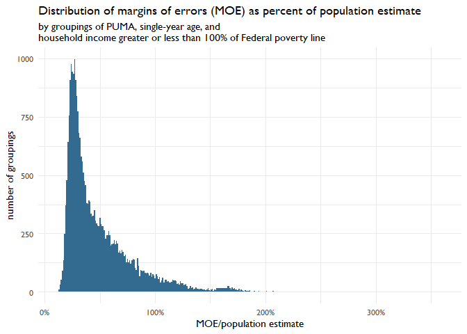

Exploring margin of error in ACS drill-downs
================
Jane Yang
9 August 2023

The draft *Birth through Five Population Explorer* is based on the
2017-2021 American Community Survey (ACS) data, downloaded from [IPUMS
USA](https://usa.ipums.org/usa/). We joined the ACS data with a state
name to FIPS mapping and 2021 state median incomes for a household of
four people used by the Department of Health and Human Services (HHS)
for the Low Income Home Energy Assistance Program (LIHEAP).

Using the [successive difference replication variance
methodology](https://www2.census.gov/programs-surveys/acs/tech_docs/accuracy/2021_ACS_Accuracy_Document_Worked_Examples.pdf),
we can calculate margins of errors for population estimates for specific
cross-sections of children.

``` r
#### examine margin of errors in population estimates ####
# create survey object
d_b5_svy <- as_survey(d_b5, weight = perwt, repweights = matches("repwtp[0-9]+"),
    type = "JK1", scale = 4/ 80 , rscales = rep(1, 80 ), mse = TRUE)

# calculate margin of error when aggregating by puma, age year, and
# household income <= 350% of poverty level
s_b5 <- d_b5_svy %>%
    mutate(household_income_less_than_350pct_poverty = poverty <= 350) %>%
    group_by(
        state, statefip, puma,
        age,
        household_income_less_than_350pct_poverty,
    ) %>%
    summarize(
        # estimate population with standard error
        population_estimate = survey_total(vartype = "se"),
        # calculate sample size for each aggregation
        acs_sample_size = n(),
    ) %>%
    ungroup()

s_b5 <- s_b5 %>% 
    mutate(
        # multiply SE by 1.645 to get MOE at 90% conf level (Census standard)
        population_estimate_moe = population_estimate_se * 1.645,
        population_estimate_moe_pct_of_estimate = population_estimate_moe/population_estimate,
    )
```

For instance, we can examine the margin of errors (MOE) as a percent of
the population estimate for groupings of [public use microdata areas
(PUMAs)](https://www.census.gov/programs-surveys/geography/guidance/geo-areas/pumas.html),
single-year ages, and whether a child lives in a household with \<350%
the Federal poverty line. There are 28,204 such groupings. The following
histogram illustrates the distribution.

``` r
# visualize distribution of MOE as pct of estimate
g_moe_pct <- ggplot(s_b5) +
    geom_histogram(
        aes(x = population_estimate_moe_pct_of_estimate),
        binwidth = 0.01,
        fill = acf_palette[2]
    ) +
    labs(
        title = "Distribution of margins of errors (MOE) as percent of population estimate",
        subtitle = "by groupings of PUMA, single-year age, and\nhousehold income greater or less than 350% of Federal poverty line",
        x = "MOE/population estimate",
        y = "number of groupings"
    ) +
    scale_x_continuous(labels = label_percent(accuracy = 1))

g_moe_pct
```

<!-- -->

Of the combinations of PUMA, age by year, and indicator of whether a
child lives in a household with \<350% the Federal poverty line, 1% have
an MOE \> 100% of the population estimate and 21% have an MOE \> 50% of
the population estimate.

The draft *B-5 Explorer* allows for significantly more filters to be
applied to a population grouping, which results in even smaller sample
sizes behind each population estimate. The MOE need to be further
examined for cases with more granular filters and the filters themselves
should be reconsidered for the highest priority ones that would be
useful for lead agencies serving children.
